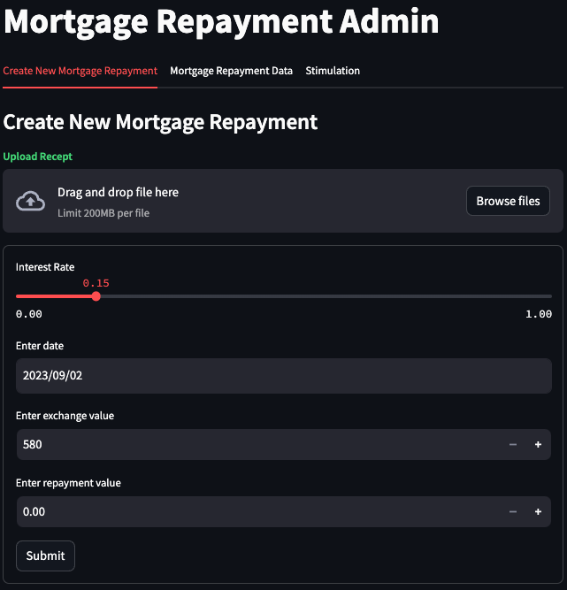
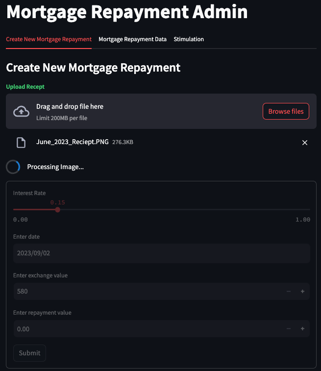
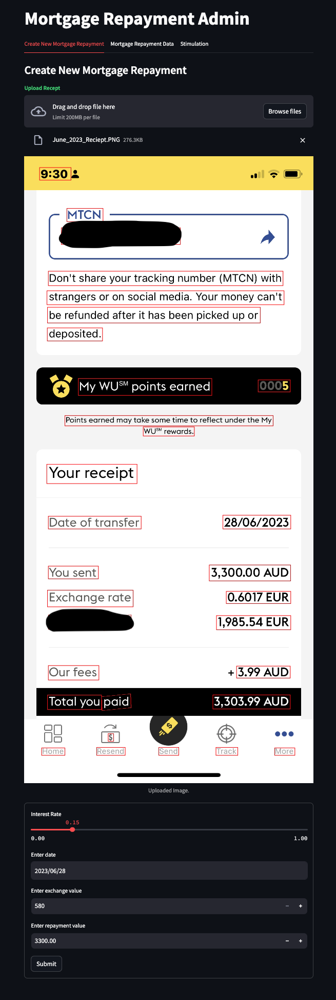
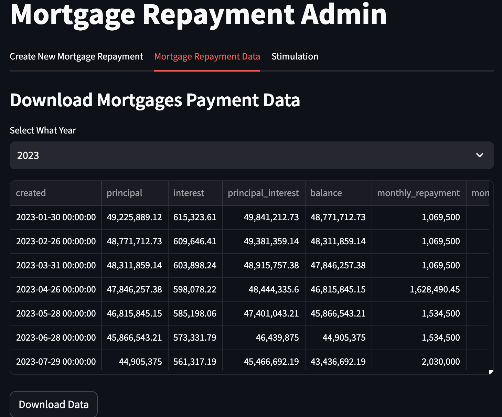

# Mortgage Repayment Admin 
This is a simple mortgage repayment admin app built with Streamlit. It is a frontend app that allow a receipt to be uploaded and apply Optical Character Recognition (OCR) to extract information from the image. The information is used to populate a form that use [mortgage repayment API](https://github.com/statsit/mortgage-app.git) to calculate the monthly repayment and total repayment. The form is then submitted to the backend API for storage in the database. The app also allow the user to view all the mortgage repayment records in the database. 

## Demos
### Admin View 1

### Admin View 2

### Admin View 3

### Admin View 4



## Installation
### Prerequisites
```bash
  pip install poetry
```
    
## Run Locally
1. Clone the project

```bash
  git clone https://github.com/statsit/Mortgage-admin.git
```

2. Go to the project directory

  ```bash
    cd Mortgage-admin
  ```
3. Install dependencies

  ```bash
    poetry install
  ```
  
4. Start the server. Ensure the backend is running before starting the frontend. Use port 8000 for the backend and port 3000 for the frontend. For backend, check [here](https://github.com/statsit/mortgage-app.git).
  
  ```bash
    poetry run streamlit run mortgage_admin/admin.py
  ```

# Hi, I'm Ade! 👋


## 🚀 About Me
I'm a full stack AI developer...


## Authors

- [@aakinlalu](https://www.github.com/aakinlalu)


## 🛠 Skills
AI, ML, DE,  Python, Javascript, ReactJS, HTML, CSS...


## 🔗 Links
[](https://codestreet.ai/)
[](https://www.linkedin.com/in/adebayo-akinlalu-5451a129/)
[](https://twitter.com/Akinlalu)


## Acknowledgements

 - [streamlit](https://docs.streamlit.io/)
 - [easyocr](https://www.jaided.ai/easyocr/documentation/)